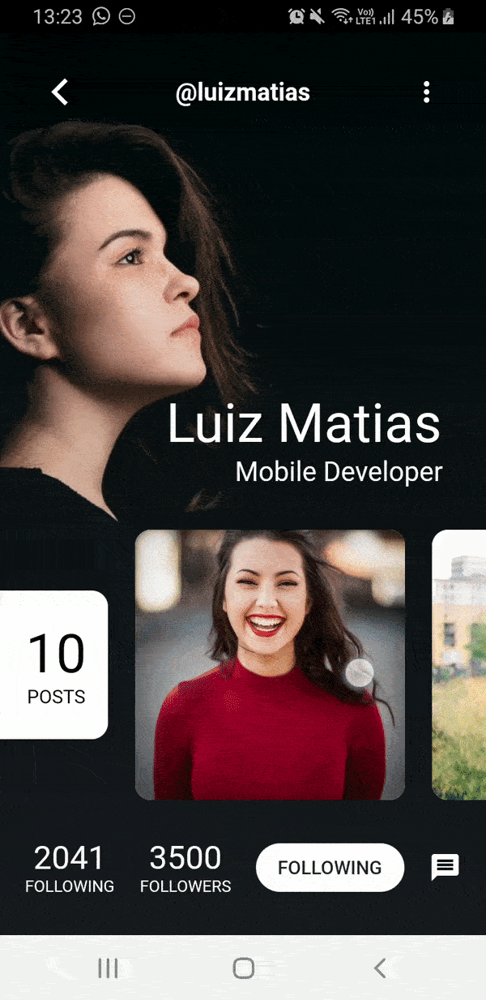

# Flutter UX
Neste repositório, estou deixando todos os códigos que estou utilizando para aprender sobre layouts e componentização no Flutter. Aqui tem layouts feitos do zero, implementações de conceitos de designers do UPLabs, Bechance, etc. e clones de layouts de aplicativos famosos.

## O que você pode encontrar de útil por aqui
- Imitações de aplicativos famosos feitos em Flutter (Instagram, Nubank, etc.).
- Animações complexas de usabilidade.
- Projetos pessoais feitos do zero.

## Apps clonados com sucesso:
### Nubank

### Instagram

### Profile Screen
Conceito criado por Joshua Oluwagbemiga (https://www.uplabs.com/posts/profile-2styles-xd-freebie)

### Instagram Redesign
Conceito criado por Xitij Thakkar (https://dribbble.com/xitijdesign)

